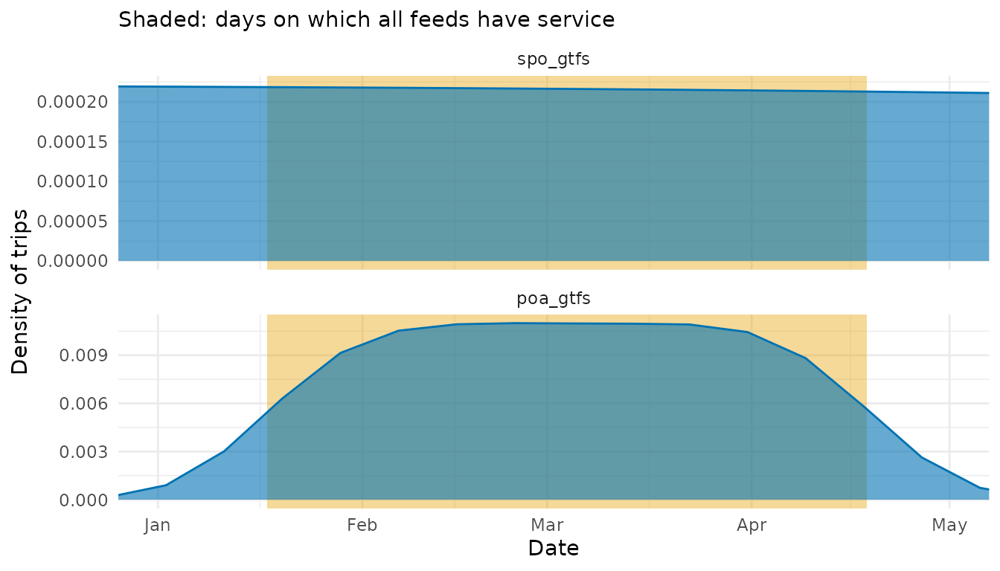
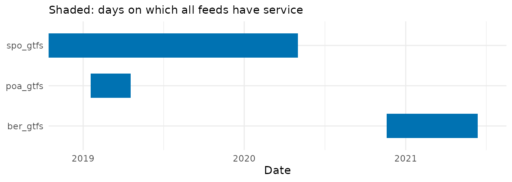

# Checking the calendar overlap of GTFS feeds

Routing and accessibility analyses often combine several GTFS feeds,
such as those of the different transit agencies of a metropolitan
region. Routing engines such as [r5r](https://github.com/ipeaGIT/r5r)
and OpenTripPlanner work on a given departure date, which must have
service in every feed: otherwise, one of the networks silently drops out
of the analysis. Feeds are published at different times and cover
different periods, so such a date is not always easy to find.

[`get_calendar_overlap()`](https://ipea.github.io/gtfstools/dev/reference/get_calendar_overlap.md)
compares the calendars of several feeds. It only hsa two arguments. Its
`resolution` argument controls what the result captures:

- `resolution = "daily"` (the default) captures the **intensity** of
  transit services: the number of trips each feed runs on each of its
  service days, and whether all feeds have service on that day.
- `resolution = "periods"` captures whether there is **any** service:
  the periods of consecutive days on which every feed runs at least one
  trip, however few.

A day may thus belong to an overlap period even if one of the feeds runs
only a handful of trips on it, which the daily trips reveal. With
`plot = TRUE`, either result is plotted with
[ggplot2](https://ggplot2.tidyverse.org).

``` r

library(gtfstools)
library(ggplot2)
library(dplyr)
```

## Trips per day

Feeds can be given as paths to their `.zip` files. In this case, the
large `shapes` and `stop_times` tables are not read. By default, the
function returns one row per feed and service day:

``` r

spo_path <- system.file("extdata/spo_gtfs.zip", package = "gtfstools")
poa_path <- system.file("extdata/poa_gtfs.zip", package = "gtfstools")

daily_trips <- get_calendar_overlap(c(spo_path, poa_path))

daily_trips |> 
  dplyr::filter( overlap == TRUE) |> 
  head()
#>        feed       date n_trips overlap
#>      <char>     <Date>   <int>  <lgcl>
#> 1: spo_gtfs 2019-01-18    7948    TRUE
#> 2: spo_gtfs 2019-01-19    7945    TRUE
#> 3: spo_gtfs 2019-01-20    7945    TRUE
#> 4: spo_gtfs 2019-01-21    7948    TRUE
#> 5: spo_gtfs 2019-01-22    7948    TRUE
#> 6: spo_gtfs 2019-01-23    7948    TRUE
```

`n_trips` is the number of trips that run on the day, and `overlap`
tells whether all feeds have service on it. Trips listed in
`frequencies` count once per departure, so feeds that describe their
service with frequencies are comparable with feeds that list every trip.

A feed has service on a day when at least one of its services runs on
it, according to the weekdays and dates in `calendar` and the exceptions
in `calendar_dates`. Services not used by any trip are ignored. Feeds
already read with
[`read_gtfs()`](https://ipea.github.io/gtfstools/dev/reference/read_gtfs.md)
(and possibly edited afterwards) can also be given as a list, whose
names are used as feed names,
e.g. `get_calendar_overlap(list(spo = spo_gtfs, poa = poa_gtfs))`.

With `plot = TRUE`, the density of each feed’s trips over time is
plotted in a panel of its own, weighting each day by its number of
trips. The days on which all feeds have service are shaded:

``` r

get_calendar_overlap(c(spo_path, poa_path), plot = TRUE) +
  coord_cartesian(xlim = as.Date(c("2019-01-01", "2019-05-01")))
```



The result is a regular `ggplot` object, so it can be customised with
[ggplot2](https://ggplot2.tidyverse.org) functions, e.g. to zoom in on a
period, as above.

The daily trips help pick a departure date on which every feed runs its
usual level of service, such as a regular weekday away from holidays.
For example, the trips each feed runs on the first Wednesday on which
both have service (`format(x, "%u")` numbers weekdays from 1, Monday,
regardless of the locale):

``` r

overlap_days <- unique(daily_trips$date[daily_trips$overlap])
departure_date <- overlap_days[format(overlap_days, "%u") == "3"][1]

daily_trips[daily_trips$date == departure_date, ]
#>        feed       date n_trips overlap
#>      <char>     <Date>   <int>  <lgcl>
#> 1: spo_gtfs 2019-01-23    7948    TRUE
#> 2: poa_gtfs 2019-01-23     194    TRUE
```

## Overlap periods

When only the dates matter, `resolution = "periods"` summarises the days
on which all feeds have service into periods of consecutive days, with
their first and last days (both included) and their length:

``` r

get_calendar_overlap(c(spo_path, poa_path), resolution = "periods")
#>    start_date   end_date n_days
#>        <Date>     <Date>  <int>
#> 1: 2019-01-18 2019-04-18     91
```

The São Paulo and Porto Alegre feeds overlap for 91 days, from January
18 to April 18, 2019. When the feeds don’t overlap, the result has no
rows:

``` r

ber_path <- system.file("extdata/ber_gtfs.zip", package = "gtfstools")
feeds <- c(spo_path, poa_path, ber_path)

get_calendar_overlap(feeds, resolution = "periods")
#> Empty data.table (0 rows and 3 cols): start_date,end_date,n_days
```

With `plot = TRUE`, a timeline shows why. Each feed is a bar spanning
its service days, and the periods in which all feeds have service are
shaded in the background. The São Paulo feed spans more than 12 years,
so the plot is zoomed in:

``` r

get_calendar_overlap(feeds, resolution = "periods", plot = TRUE) +
  coord_cartesian(xlim = as.Date(c("2018-12-01", "2021-07-01")))
```



The Berlin feed starts in November 2020, after the São Paulo feed ends,
so no date has service in all three feeds.

Once a date is chosen, the feeds can be combined into a single one with
[`merge_gtfs()`](https://ipea.github.io/gtfstools/dev/reference/merge_gtfs.md),
or reduced to the services of that date with the filtering functions
(see the [filtering
vignette](https://ipea.github.io/gtfstools/dev/articles/filtering.md)).
